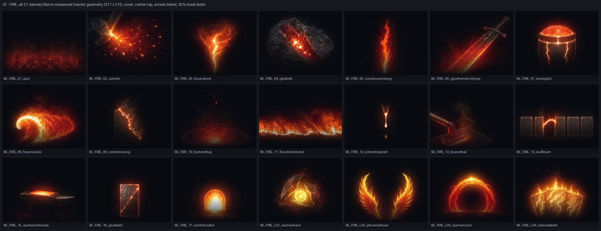
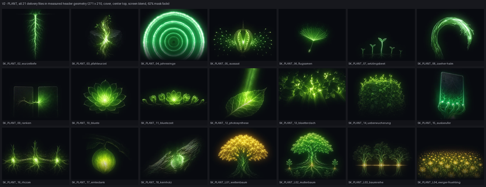

# Visual review — icons-skills

Tier-C V1–V4 record for the task contract. The owner supplies the visual judgement; the worker
captures, measures, and classifies it.

## V1 — owner baseline

The task contract records that the owner captured V1 on 2026-08-22 before this task started. The
baseline file was not present in this worktree and was not supplied to the worker. Consequently:

- the worker did not reconstruct V1 after the change;
- the worker cannot independently verify V1's viewport, DPR, or application state;
- the owner was explicitly asked to compare the V2 material against the owner-held V1 before
  passing V3.

This is a limit, not a substitute for the missing provenance. The task-contract checkbox requiring
a V2 capture at exactly the V1 size, DPR, and state remains open.

## V2 — post-change captures

The prepared asset-level capture set contains every Fire and Plant delivery file rendered in the
measured offer-card header geometry: 271×210 px (the 270.66 px live width rounded to a raster pixel),
`cover`, `center top`, Screen blending over the card background, and a mask fading after 62%.





The deterministic renderer is `render-strip-review.py`. Reproduce the files from the delivery
assets with:

```powershell
py -3 docs/workstreams/desktop-icons/icons-skills/render-strip-review.py --lot fire `
  --output docs/workstreams/desktop-icons/icons-skills/visual/V2-fire-strip-geometry.png
py -3 docs/workstreams/desktop-icons/icons-skills/render-strip-review.py --lot plant `
  --output docs/workstreams/desktop-icons/icons-skills/visual/V2-plant-strip-geometry.png
```

These are geometry-accurate asset renders, not screenshots of the running application. The Vite
server returned HTTP 200 at `http://localhost:5183` and was started again during review remediation,
but the supported browser runtime still reported no available browser. The worker did not switch to
an unrelated browser-control mechanism.

The per-file and per-lot measurements are in `light-measurement.md`. The two decisions called out to
V3 were:

- Fire: `SK_FIRE_12` measures 0.2 light against a lot median of 25.4 and is visibly the smallest,
  darkest gesture.
- Plant: `SK_PLANT_04` measures 181.4 against a lot median of 28.2 (roughly 6.4×), while
  `SK_PLANT_L04` measures 93.7 (roughly 3.3×).

## V3 — human visual gate: passed

| Field | Value |
| --- | --- |
| Decided by | Owner / local user |
| Date | 2026-08-22 |
| Reviewed | Both V2 contact sheets above, with the Fire and Plant light outliers named in the prompt |
| Verdict, verbatim | **“Bestanden, kein Cap”** |
| Result | Ship both lots as generated; apply no per-lot brightness cap |

This closes the human visual judgement on the asset-level V2 evidence. It does **not** fill the
separate acceptance-gate gap: the worker still has not seen every Fire and Plant offer card render
inside the running application.

## V4 — classification

| ID | Finding (2026-08-22) | Classification | Disposition |
| --- | --- | --- | --- |
| `ICONS-VIS-03` | Fire offer cards previously rendered without header art because the incomplete master lot caused the all-or-nothing bake to skip Fire. The lot is now mapping-complete, baked, registry-checked, and bundled, but the worker could not capture every Fire card in the running application. | **Expected platform behaviour — resolution mechanically proven, live confirmation open** | Keep open until the acceptance gate is observed in-app; do not claim full resolution from the contact sheet alone. |
| `ICONS-VIS-04` | Donnergott gold reads in two places despite the art README's one-place statement for legendary Lightning artwork. | **New design question, carried in; out of scope** | Artwork remains final and owner-approved. No Lightning file was changed and no broader gold audit was made a shipping gate. |
| `ICONS-VIS-05` | `SK_FIRE_12` is the Fire low-light outlier (0.2 vs 25.4 median) and is visibly much sparser than its siblings. | **New design question — closed at V3, no action** | The allowed cap only pulls bright art down. Owner accepted the sparse gesture in the set; no artwork edit or lift applied. |
| `ICONS-VIS-06` | `SK_PLANT_04` is the Plant high-light outlier (181.4 vs 28.2 median), with `SK_PLANT_L04` second at 93.7. | **New design question — closed at V3, no action** | Owner chose “Bestanden, kein Cap”; both ship as generated. |

No V4 row is classified as a defect in this task. The open portion of `ICONS-VIS-03` is an evidence
gap against the binding acceptance gate, not permission to alter wiring or global bloom constants.
